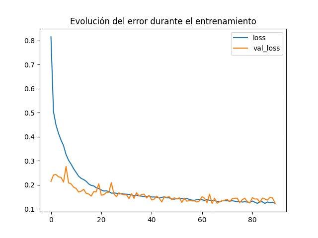

# Conclusiones

## Ingeniería de características: Discretización del estado

Para que el agente tabular pudiera aprender, transformamos las señales continuas del juego en un conjunto finito de enteros capaces de indexar la Q-table.
Se usaron cinco variables, calculadas con los 8 estados del juego, como representación del entorno:

1. Distancia horizontal al primer tubo (usamos `next_pipe_dist_to_player`)
2. Diferencia vertical entre el jugador y el centro del hueco del primer tubo (`player_y,next_pipe_top_y, next_pipe_bottom_y`)
3. Distancia horizontal al segundo tubo (`next_next_pipe_dist_to_player`)
4. Diferencia vertical entre el jugador y el centro del hueco del segundo tubo (`player_y,next_next_pipe_top_y, next_next_pipe_bottom_y`)
5. Velocidad vertical del jugador (`player_vel`)

Cada valor continuo se agrupa en “buckets” para reducir el número de estados posibles:

* **Primer tubo** (`dx1`, `dy1`): buckets de **25 px**
* **Segundo tubo** (`dx2`, `dy2`): buckets de **40 px**
* **Velocidad**: se mantiene tal cual (enteros de –8 a +8)

Por ejemplo, si `dx1 = 137.3 px`, calculamos

```python
dx1_bin = int(137.3 // 25)  # = 5
```

Así, todos los dx entre 125–149 px caen en el mismo bucket. Al aplicar este mismo procedimiento a las cinco variables obtenemos una tupla discreta:

```python
(dx1_bin, dy1_bin, dx2_bin, dy2_bin, vel_bin)
```

Este enfoque mantiene suficiente **resolución** para distinguir situaciones críticas sin generar una Q-table inmanejable. Como resultado, el agente aprendió políticas que resultaron eficaces, evitando la explosión combinatoria de estados que produciría una discretización más fina.


---

## Análisis y comparación de agentes

### Agente Q-Learning

- **Episodios de entrenamiento**: 20.000
- **Parámetros**:
  - Learning rate: 0.2
  - Discount factor: 0.95
  - Epsilon inicial: 1.0, mínimo: 0.05, decay: 0.995
- **Recompensa promedio final**: entre 15 y 20 puntos
- **Generalización**: buena. El agente mantuvo su performance al ejecutar en test sin exploración (`epsilon = 0`).
- **Ventajas**:
  - Implementación simple
  - Resultados estables
- **Limitaciones**:
  - Espacio de estados limitado por la discretización
  - La tabla puede crecer si se intenta una discretización más fina

---

### Agente con red neuronal (DQN con Q-table aproximada)

- **Arquitectura del modelo**:
```python
model = keras.Sequential([
     layers.Input(shape=(X.shape[1],)), # (shape=(5,))  
    layers.Dense(64, activation='relu'),
    layers.Dropout(0.2),
    layers.Dense(32, activation='relu'),
    layers.Dense(y.shape[1]) # (dos acciones posibles)
])  
```

- **Entrenamiento**:
  - Epochs: 90
  - Batch size: 64
  - Validation split: 0.2
  - Optimizer: Adam
  - Loss: MSE

- **Resultados**:
  - El modelo convergió sin overfitting
  - Las curvas de `loss` y `val_loss` evolucionaron de forma conjunta y convergieron en torno a 0.15
  - En test, las recompensas obtenidas variaron entre -1 y 159, lo cual indica que puede generalizar y aprender políticas útiles
  - Se probó con distintos parámetros de ejecución (por ejemplo, usando `frame_skip=2`) y el agente mantuvo su rendimiento, lo que refuerza la robustez de la aproximación neuronal

- **Gráfico del entrenamiento**:

  

- **Ventajas**:
  - Permite generalizar a estados no vistos
  - Reduce el tamaño necesario de memoria frente a una Q-table explícita
  - Es un paso hacia DQN completo, con capacidad de extender a estados continuos sin discretización

- **Desventajas**:
  - Mayor complejidad computacional
  - La predicción con redes neuronales es más lenta que acceder a una tabla, especialmente visible en la ejecución frame a frame del juego

---

## Reflexiones finales

Ambos enfoques lograron aprender a jugar de forma competente al Flappy Bird. El Q-learning clásico es eficaz con una buena ingeniería de características y discretización, pero escala mal para estados más complejos o continuos. Por su parte, el modelo basado en red neuronal mostró buena capacidad de generalización y es más flexible, aunque con un mayor coste computacional.

Este trabajo sienta las bases para evolucionar hacia **Deep Q-Learning (DQN)**, donde ya no sería necesario discretizar los estados
